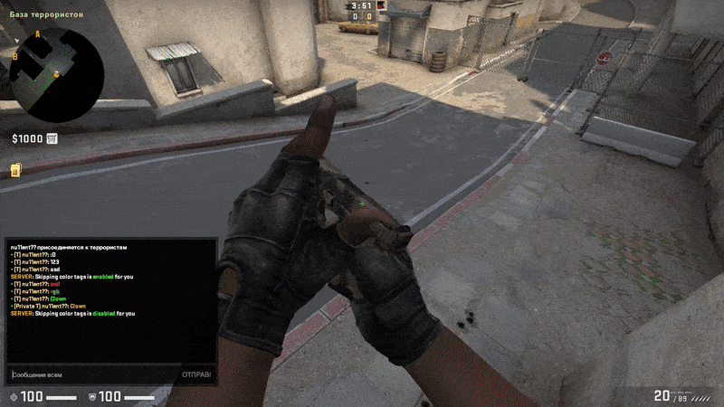
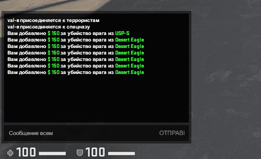
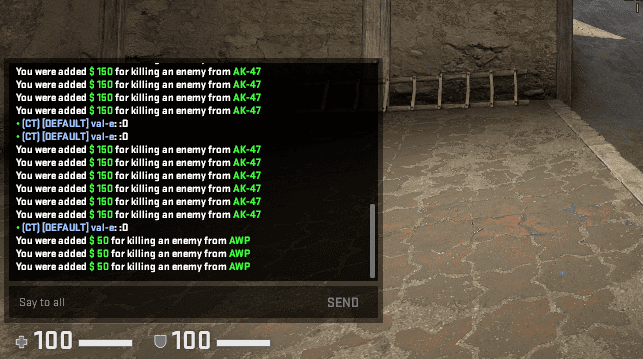
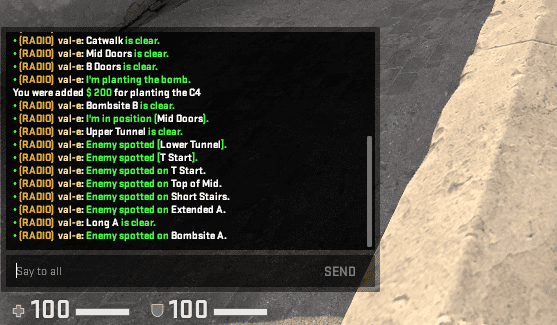

<h1 align="center">Color Chat Processor</h1>

    
    
    
    
    
    

## Navigation
- [About CCProcessor](#About)
    - [Description](#Description)
    - [Real-Time Color Processing](#Real-Time-Color-Processing)
    - [Flexible Localization](#Flexible-Localization)
    - [Extended Radio](#extended-radio)
- [Game support](#game-support)
- [Requirements](#Requirements)
- [Chat Handlers](#handlers)
- [Supported Modules](#supported-modules)
- [License](#license)

## About

### Description
The chat handler makes the hidden features of the standard in-game chat available. 
Its functionality and fixes for all known bugs make this handler the best of its kind.

### Real-Time Color Processing
RTCP is one of the features of the chat processor, which allows you to replace abbreviations with colors when sending a message

### Flexible Localization
For a long time of development, it was decided to support flexible localization.  
This approach allows you to preserve the language affiliation and form a message in the language of the player's platform.  

<b>For example `ServerLang: "en"`

- What the RU-player sees  

- What the EN-player sees at same time  

### Extended Radio
The handler also deals with the radio channel.  
You can edit already boring radio commands.  

### And more other...

## Game support
---------
- [x] Counter-Strike: Global Offensive
- [x] Counter-Strike: Source (Open Beta)
- [x] Team Fortress 2
- [x] Left 4 Dead 2

## Requirements:
-------------
- Sourcemod 1.10 
    - [Windows](http://sourcemod.net/latest.php?os=windows&version=1.10)
    - [Linux](http://sourcemod.net/latest.php?os=linux&version=1.10)

## Handlers
Handler Name | Message identifier | Package | Virtualization |
:------------: | :------------------: | :-------: | :--------------: |
|  `SayText2`  | `STA` = Public chat, `STP` = Team chat  | `ccp-saytext2.smx` | `Yes` |
|  `TextMsg`   | `TM` = Server chat | `ccp-textmsg.smx`  | `Yes` |
|  `SayText`   | `ST` = Server chat | `ccp-saytext.smx`  | `Yes` |
|  `RadioText` | `RT` = Radio chat  | `ccp-radiomsg.smx` |  `Yes` |
    
## [Supported Modules](https://github.com/nyood/ccp-modules)

## License
[GNU Public License v3](https://github.com/nyood/ccprocessor/blob/main/LICENSE)
